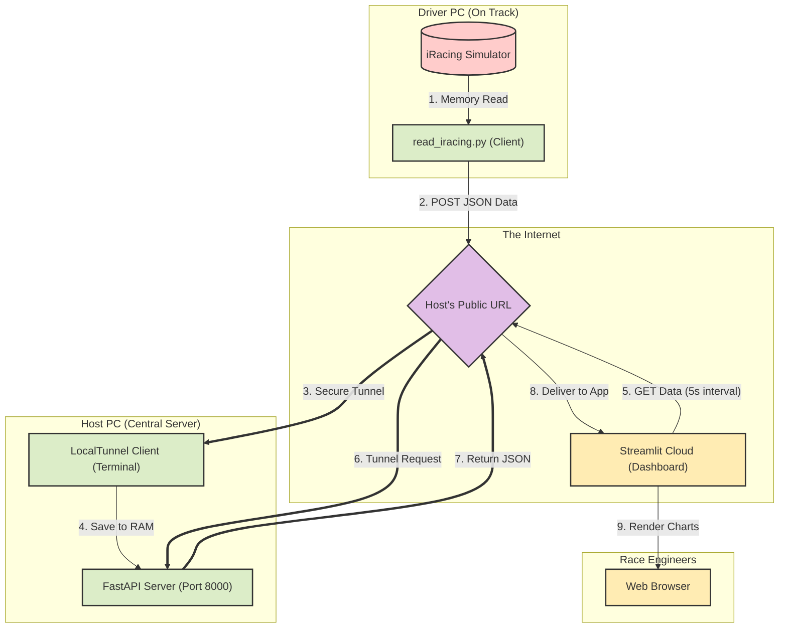

# 🏎️ Real-Time iRacing Strategy & Telemetry Deck (Cloud MVP)

A professional-grade, distributed telemetry and strategy tool for **iRacing** developed with Python, FastAPI, and Streamlit. This Cloud MVP is engineered specifically for endurance racing, allowing multiple drivers to seamlessly stream their live telemetry to a centralized, cloud-hosted dashboard accessible by the entire team anywhere in the world.

---

## 🌟 Key Features

* **Distributed Team Setup**: Drivers send telemetry to a central host via a secure internet tunnel, eliminating the need for local network configurations.
* **Cloud-Hosted Dashboard**: The Streamlit interface runs on Streamlit Community Cloud, ensuring the host's local bandwidth is strictly reserved for the racing simulator.
* **Live Fleet Tracking**: Instantly monitor driver status (Online/Offline/In Cockpit) with dynamic latency checks to ensure data integrity.
* **Unified Pace & Fuel Modeling**: Calculates fuel consumption per lap, remaining fuel, and projected stints. The pace estimation model assumes driver inputs and lap times follow a **Wide-Sense Stationary (WSS)** process under consistent conditions, providing highly stable fuel and lap projections over long endurance stints.
* **Zero-Friction Client**: Teammates only need to run a single lightweight Python script to stream their data. No heavy processing is done on the driver's machine.

---

## 🛠️ System Architecture

The application relies on a Push/Pull data flow to safely route telemetry from the simulator's memory to the web browser.

[Image of a cloud telemetry architecture with a local sim racing client pushing data through a secure tunnel to a remote dashboard]


---

## 🚀 Getting Started

### 1. Prerequisites
* **iRacing** installed and running (for drivers).
* **Python 3.10+**.
* **Node.js** (Only required for the Host to run LocalTunnel).

### 2. Installation Setup

Due to the distributed nature of the Cloud MVP, dependencies are split into two files to ensure compatibility with Linux cloud servers and Windows simulators.

**For the Team (Drivers & Host):**
Clone the repository and install the full local package, which includes the iRacing SDK and FastAPI.
```bash
git clone https://github.com/TomazFilgueira/iracing_telemetry.git
cd iracing_telemetry
pip install -r requirements_local.txt
```

---

## 🏁 Operational Guide

The system operates in three distinct layers during a race event.

### Layer 1: The Host (Central Server)
The designated host (e.g., Tomaz) must start the central brain of the operation to receive data.
1. **Install LocalTunnel globally** (first time only): `npm install -g localtunnel`
2. **Run the master batch file**: `server_anaconda_start.bat`
3. This automatically launches the **FastAPI Server** and opens a **LocalTunnel** public URL.
4. **Share the generated LocalTunnel URL** with the team (e.g., Rodrigo or Morsinaldo).

### Layer 2: The Drivers (Telemetry Streaming)
Any driver currently in the car must run the client script to broadcast their data.
1. Open `read_iracing.py` and ensure `SERVER_URL` points to the Host's LocalTunnel URL.
2. Enter the iRacing cockpit.
3. Execute the script:
   ```bash
   python read_iracing.py

### Layer 3: Race Engineers (Dashboard)
To view the strategy deck, no local software is required.

1. Access the deployed Streamlit app: https://iracingtelemetry.streamlit.app

1. In the sidebar, input the Host's LocalTunnel URL into the URL Base do Servidor field.

1. Monitor the live timing, stint lengths, and stochastic fuel modeling.

---

## 📁 Project Structure

* **`read_iracing.py`**: The lightweight client-side script. It reads telemetry data from simulator memory via SDK and POSTs JSON payloads to the central server.
* **`server.py`**: The FastAPI backend. It operates exclusively in RAM to guarantee microsecond response times and manages the telemetry state for the entire team.
* **`dashboard_cloud.py`**: The visual frontend optimized for Streamlit Community Cloud. It handles remote data fetching, timezone normalization (BRT), and renders real-time Altair charts.
* **`server_anaconda_start.bat`**: A multi-tab automation script that orchestrates the local FastAPI server and the LocalTunnel environment.
* **`requirements_local.txt`**: Complete dependency tree for desktop environments, including `pyirsdk` and `fastapi`.
* **`requirements.txt`**: Stripped-down dependency tree for the Linux-based Streamlit Cloud runtime, ensuring stable deployments.
